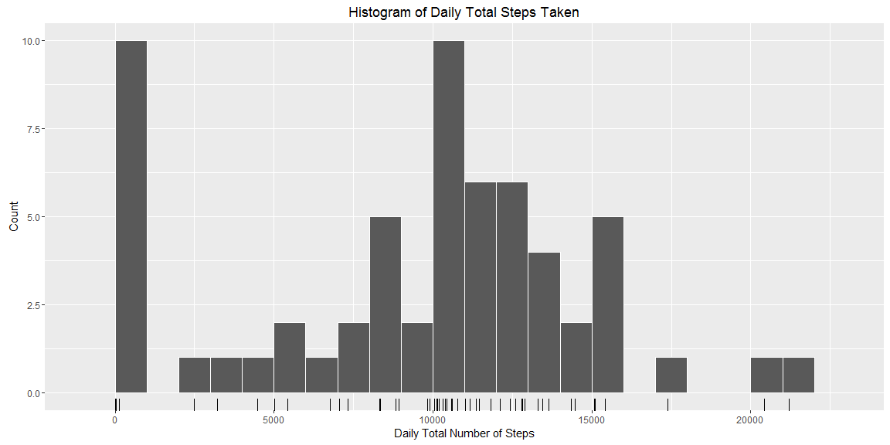

# **Reproducible Research: Peer Assessment 1**
vuiseng9  
September 19, 2016  


This R Markdown document is a course project of Reproducible Research course in Coursera John Hopkins Data Science Specialization. In this assignment, it is required to perform exploratory data analysis on provided wearables activity and document the process using R markdown & knitr.
<br><br>

## **Loading and preprocessing the data**
We'll use **plyr**, **dplyr** package as our main data processing packages. Upon loading the packages, we load the dataset into working space and take a *dplyr::glimpse* on the dataframe.


```r
library(plyr)
library(dplyr)
activity <- read.csv("activity/activity.csv", header = TRUE, na.strings = "NA")
glimpse(activity)
```

```
## Observations: 17,568
## Variables: 3
## $ steps    (int) NA, NA, NA, NA, NA, NA, NA, NA, NA, NA, NA, NA, NA, N...
## $ date     (fctr) 2012-10-01, 2012-10-01, 2012-10-01, 2012-10-01, 2012...
## $ interval (int) 0, 5, 10, 15, 20, 25, 30, 35, 40, 45, 50, 55, 100, 10...
```

From the glimpse result, we can see that the date is in factor class which is inappropriate, let's change it to **date** class.

```r
activity$date <- as.Date(as.character(activity$date),format = "%Y-%m-%d")
class(activity$date)
```

```
## [1] "Date"
```
<br><br>

## **Mean total number of steps taken per day**
To get mean total steps per day, we need to first obtain the total of steps taken for all the dates. By using *dplyr::group_by*, the dataframe is grouped by its **date**. The daily total steps are aggregated through *dplyr::summarise* by putting sum function as argument. Do note to discount the NA entries in the sum function.


```r
daily_sum <- 
  activity %>% 
  group_by(date) %>% 
  summarise(total_steps = sum(steps,na.rm=TRUE))

head(daily_sum)
```

```
## Source: local data frame [6 x 2]
## 
##         date total_steps
##       (date)       (int)
## 1 2012-10-01           0
## 2 2012-10-02         126
## 3 2012-10-03       11352
## 4 2012-10-04       12116
## 5 2012-10-05       13294
## 6 2012-10-06       15420
```

Let's plot a histogram of the total number of steps taken each day. We use ggplot here.

```r
library(ggplot2)
p1 <- 
  ggplot(daily_sum, aes(total_steps)) + 
  geom_histogram(binwidth=1000,color="white") +
  geom_rug() + 
  labs(list(title="Histogram of Daily Total Steps Taken",
            x = "Daily Total Number of Steps",
            y = "Count"))

p1
```

<!-- -->

Subsequently, we use the *summary* function on **total_steps** column of **daily_sum** dataframe to get an overview of the **total_steps**

```r
summary(daily_sum$total_steps)
```

```
##    Min. 1st Qu.  Median    Mean 3rd Qu.    Max. 
##       0    6778   10400    9354   12810   21190
```

From the summary, the median is 10400, mean is 9354.
The minumum total per day is 0 which it could be that some days have no data reading due to syncing issues. 

We can also adding the mean indication in the histogram

```r
p1 + geom_vline(xintercept = mean(daily_sum$total_steps),
                color="blue",
                size=1)
```

<!-- -->
<br><br>

## **Average Daily Activity Pattern**
Following is the snippet to obtain the mean steps taken per interval across the observed dates.

```r
interval_summary <- 
  activity %>% 
  group_by(interval) %>% 
  summarise(mean_steps = as.integer(mean(steps,na.rm=TRUE)))

head(interval_summary)
```

```
## Source: local data frame [6 x 2]
## 
##   interval mean_steps
##      (int)      (int)
## 1        0          1
## 2        5          0
## 3       10          0
## 4       15          0
## 5       20          0
## 6       25          2
```

```r
tail(interval_summary)
```

```
## Source: local data frame [6 x 2]
## 
##   interval mean_steps
##      (int)      (int)
## 1     2330          2
## 2     2335          4
## 3     2340          3
## 4     2345          0
## 5     2350          0
## 6     2355          1
```

```r
glimpse(interval_summary)
```

```
## Observations: 288
## Variables: 2
## $ interval   (int) 0, 5, 10, 15, 20, 25, 30, 35, 40, 45, 50, 55, 100, ...
## $ mean_steps (int) 1, 0, 0, 0, 0, 2, 0, 0, 0, 1, 0, 0, 0, 0, 0, 0, 0, ...
```

Examing the **interval_summary** dataframe through *head(), tail() & glimpse()* , the **interval** is an integer vector. it'll more appropriate to display them in 24h standard. Here is how we do it, using *stringr:str_pad* to pad leading zeros.

```r
library(stringr)
interval_summary$interval <- str_pad(interval_summary$interval,4,pad="0")
head(interval_summary)
```

```
## Source: local data frame [6 x 2]
## 
##   interval mean_steps
##      (chr)      (int)
## 1     0000          1
## 2     0005          0
## 3     0010          0
## 4     0015          0
## 5     0020          0
## 6     0025          2
```


```r
p2 <- ggplot(interval_summary, aes(x=as.POSIXct(as.character(interval),
                                                format="%H%M",
                                                tz = "GMT"),
                                   y=mean_steps)) +
      geom_line(size=0.8) + 
      scale_x_datetime(date_breaks = "2 hours",date_labels = "%H:%M") + 
      labs(list(title = "Average Steps taken per 5mins interval in a day",
                x = "time(hr:mm)",
                y = "Number of Steps"))

p2
```

<!-- -->

**8:30 - 8:35am** is the time interval that has highest average number of steps taken (**206**) from Oct to Nov 2012.

```r
interval_summary[which.max(interval_summary$mean_steps),]
```

```
## Source: local data frame [1 x 2]
## 
##   interval mean_steps
##      (chr)      (int)
## 1     0835        206
```
<br><br>

## **Imputing Missing Values**
How many missing step count in the dataset?

```r
sum(is.na(activity$steps))
```

```
## [1] 2304
```
What is the ratio of missing values?

```r
mean(is.na(activity$steps))
```

```
## [1] 0.1311475
```

There are a number of days/intervals where there are missing values (coded as NA). The presence of missing days may introduce bias into some calculations or summaries of the data. 

Following is the snippet to impute NA values with mean steps of the same interval across Oct - Nov'12. 
Using *split-apply-combine* strategy, we deploy *plyr::ddply* to first split **activity** dataframe by the **interval** and apply a funtion to assign mean of the interval to the NA entries and finally combine the splitted subset. 


```r
activity2 <- ddply(activity, .(interval), 
                   function(x){
                     
                     x$steps[is.na(x$steps)] <- as.integer(mean(x$steps,na.rm=TRUE))
                     return(x)
                     
                     }) %>% arrange(date,interval)
```
Now, we see that there is 0 NA in the steps column.

```r
sum(is.na(activity2$steps))
```

```
## [1] 0
```

Let's see how the imputation affects the values. We create a new dataframe **daily_sum2** to store the total steps for each day and merging it to the initial **daily_sum**.

```r
daily_sum2 <- 
  activity2 %>% 
  group_by(date) %>% 
  summarise(total_steps = sum(steps,na.rm=TRUE))

df <- merge(daily_sum,daily_sum2,by = "date")
names(df) <- c("date","Missing values","Mean imputation")
```

To ease ggplot, we need to further transform the dataframe from wide to long format by using **reshape** package.

```r
library(reshape2)
df_melted <- melt(df,
                  id.vars = "date",
                  variable.name = "state",
                  value.name = "total_steps")

p3 <- ggplot(df_melted, aes(x=total_steps,fill=state)) 

p3 + geom_histogram(binwidth = 1000, position = "dodge") +
  labs(list(title="Histogram of Daily Total Steps Taken",
            x = "Daily Total Number of Steps",
            y = "Count"))
```

<!-- -->
See that? After NA imputation, the number of days having 0 total taken steps have dropped. How about the change in mean and median? 

```r
summary(daily_sum$total_steps)
```

```
##    Min. 1st Qu.  Median    Mean 3rd Qu.    Max. 
##       0    6778   10400    9354   12810   21190
```

```r
summary(daily_sum2$total_steps)
```

```
##    Min. 1st Qu.  Median    Mean 3rd Qu.    Max. 
##      41    9819   10640   10750   12810   21190
```
Notice that after the imputation, the mean is now closer to median!
<br><br>

## **Differences in activity patterns between weekdays and weekends**
We'll continue our exploration with imputed dataset. To visualize the pattern differences in weekdays and weekends, we need to create a variable with these two level. With *strftime()* and format of *%u%, a column of indicating day of the week such that Monday is 1, Tuesday is 2 and so forth. To segregate weekdays and weekends, we apply a ifelse condition. 

```r
activity2$dayofweek <- 
  strftime(as.POSIXct(activity2$date,
                      format="%Y-%m-%d"),
           format = "%u")

head(activity2,3)
```

```
##   steps       date interval dayofweek
## 1     1 2012-10-01        0         1
## 2     0 2012-10-01        5         1
## 3     0 2012-10-01       10         1
```

```r
activity2$when <- ifelse(activity2$dayofweek < 6,"weekday","weekend")
head(activity2,3)
```

```
##   steps       date interval dayofweek    when
## 1     1 2012-10-01        0         1 weekday
## 2     0 2012-10-01        5         1 weekday
## 3     0 2012-10-01       10         1 weekday
```
Now, we have a variable to separate weekdays and weekends. Next, we are going to get the interval mean steps across weekdays and weekends by *group_by(when,interval)*

```r
interval_summary_by_when <- 
  activity2 %>% 
  group_by(when,interval) %>% 
  summarise(mean_steps = as.integer(mean(steps,na.rm=TRUE)))

head(interval_summary_by_when,3)
```

```
## Source: local data frame [3 x 3]
## Groups: when [1]
## 
##      when interval mean_steps
##     (chr)    (int)      (int)
## 1 weekday        0          2
## 2 weekday        5          0
## 3 weekday       10          0
```
Alright, let's plot it!

```r
interval_summary_by_when$interval <- str_pad(interval_summary_by_when$interval,4,pad="0")

p4 <- ggplot(interval_summary_by_when, 
             aes(x=as.POSIXct(as.character(interval),format="%H%M",tz = "GMT"),
                 y=mean_steps))

p4 + 
  facet_grid(when~.) + 
  geom_line(size=0.8) + 
  scale_x_datetime(date_breaks = "2 hours",date_labels = "%H:%M") + 
  labs(list(title = "Differences of Average Interval Steps taken between Weekdays and Weekends",
                x = "time(hr:mm)",
                y = "Number of Steps"))
```

<!-- -->

What is interesting is that the noon to evening of weekend has higher steps taken that weekday. It could be that the user is working in office during weekdays and having more outings in weekends.
